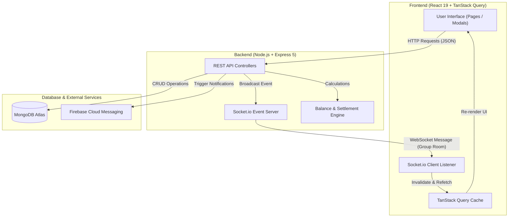

# SplitX

> A modern, full-stack real-time expense splitting and group settlement platform built for seamless group financial management.

[](https://react.dev/)
[](https://nodejs.org/)
[](https://expressjs.com/)
[](https://www.mongodb.com/)
[](https://socket.io/)
[](https://tanstack.com/query/latest)
[](https://vite-pwa-org.netlify.app/)

---

## 📖 Overview

Managing shared expenses during group trips, household living, or outings often leads to confusion, manual calculation errors, and delayed repayments. **SplitX** solves this problem by providing a centralized, real-time financial tracking platform that automates debt simplification, equal/exact bill splits, and instant settlement recording.

Built with a modern Single Page Application (SPA) architecture on the frontend and an Express/MongoDB backend, SplitX keeps all group members instantly in sync via WebSocket rooms. Whenever a user adds an expense, records a settlement, or joins a group, updates are pushed in real time without requiring page refreshes.

🔗 **Live Demo**: [https://split-x-app-pied.vercel.app](https://split-x-app-pied.vercel.app)

---

## 📍 Table of Contents

- [Overview](#-overview)
- [Key Features](#-key-features)
- [Tech Stack](#-tech-stack)
- [Architecture \& Data Flow](#-architecture--data-flow)
- [Folder Structure](#-folder-structure)
- [API \& Socket Events Reference](#-api--socket-events-reference)
- [Installation \& Local Setup](#-installation--local-setup)
- [Screenshots \& Demo](#-screenshots--demo)
- [Future Roadmap](#-future-roadmap)
- [Contributing](#-contributing)
- [License](#-license)

---

## ✨ Key Features

- ⚡ **Real-Time Group Synchronization**: Powered by Socket.io room subscriptions. Adding, updating, or deleting expenses instantly broadcasts updates to all active group members.
- ⚖️ **Flexible Expense Splitting**:
  - **EQUAL Split**: Automatically divides the expense amount equally among all selected group members.
  - **EXACT Split**: Allows custom precise amount allocation per member with live total validation.
- 💬 **Interactive Group Activity Feed**: Displays group expenses and settlement transactions in a chronological, chat-style activity stream (`ExpenseChatList`).
- 💵 **Smart Balance & Settlement System**:
  - Automatically calculates net balances (`payList` and `receiveList`) for every member in a group.
  - Interactive **Settle Modal** allowing members to record direct payments and clear pending dues.
  - **Leave Group Guard**: Prevents members from leaving a group until their net balance is completely settled (₹0).
- 🔗 **Group Management & Invite System**:
  - Create groups, view member roles, and manage group details.
  - Unique invite code generation (`/invite/:inviteCode`) allowing seamless one-click member onboarding.
- 📊 **Interactive Analytics Dashboard**:
  - Financial overview showing total net balance, total owed to you ("To Receive"), and total you owe ("To Pay").
  - Category & group breakdown charts powered by Recharts (Donut chart representation).
  - Recent activity feed logging all expense and settlement events across groups.
- 🔒 **Secure Authentication**:
  - JWT-based authentication using HTTP-only cookies and access tokens.
  - Password encryption using `bcrypt`.
  - Automatic token refresh mechanism using Axios interceptors (`/auth/refresh`).
- 🔔 **PWA & Web Push Notifications**:
  - Progressive Web App support built using `vite-plugin-pwa` for offline capability.
  - Push notifications powered by Firebase Cloud Messaging (FCM) and Resend API.
- 🎨 **Responsive Dark Mode UI**: Designed with CSS custom tokens, smooth animations via `framer-motion`, toast notifications (`react-hot-toast`), and adaptive layouts for desktop and mobile screens.

---

## 🛠️ Tech Stack

| Category | Technology | Description |
| :--- | :--- | :--- |
| **Frontend Framework** | React 19, Vite | Single Page Application framework & build tool |
| **Routing** | React Router DOM v7 | Client-side routing and protected layout guards |
| **State & Data Fetching** | TanStack Query (React Query v5), Axios | Server state management, caching, optimistic updates |
| **Real-Time Communication**| Socket.io-Client v4.8 | WebSockets for live group updates |
| **Styling & UI** | Vanilla CSS, Framer Motion, Remixicon | Modern dark theme, custom design system & animations |
| **Charts** | Recharts | Financial dashboard visualizations |
| **Backend Runtime** | Node.js, Express.js v5 | RESTful API server |
| **Database & ODM** | MongoDB, Mongoose v9 | NoSQL document database and schema validation |
| **Authentication** | JSON Web Token (JWT), bcrypt | Secure token management & password hashing |
| **Push & Email** | Firebase Admin SDK, Resend API | Web push notifications & transactional emails |
| **PWA Support** | `vite-plugin-pwa`, Service Workers | Progressive Web App installability |

---

## 🏗️ Architecture & Data Flow

SplitX uses a hybrid REST + WebSocket architecture to balance reliable data persistence with instant client state synchronization.



### Real-Time Update Sequence
1. A user submits an expense or settlement via a REST API endpoint.
2. The server updates the database and calculates updated net balances.
3. The server emits a Socket.io event (e.g., `expense-added`) to the specific `groupId` room.
4. Active client sockets subscribed to the room receive the event and automatically trigger TanStack Query cache invalidation (`queryClient.invalidateQueries`).
5. All members' UIs re-render with updated balances instantly without a page reload.

---

## 📁 Folder Structure

```text
SplitX/
├── Backend/
│   ├── src/
│   │   ├── controller/       # API Request handlers (auth, group, expense, settlement, profile)
│   │   ├── middleware/       # JWT auth & error handling middlewares
│   │   ├── models/           # Mongoose schemas (User, Group, Expense, Settlement, Notification)
│   │   ├── routes/           # Express router endpoints
│   │   ├── services/         # Business logic & balance calculation engine
│   │   │   ├── calculation/  # Net balance, pay/receive list builder modules
│   │   │   └── notification/ # Push notification dispatchers
│   │   └── sockets/          # Socket.io connection & room event handlers
│   ├── server.js             # HTTP & Socket.io server entry point
│   ├── app.js                # Express app initialization & middleware stack
│   └── package.json
│
└── client/
    ├── api/                  # Axios instance & API client modules
    ├── public/               # Static assets & PWA manifest / service workers
    ├── src/
    │   ├── auth/             # Login & Register views & AuthLayout
    │   ├── components/       # Shared UI components (Buttons, Inputs, Spinners)
    │   ├── context/          # React Contexts (AuthContext, SocketContext)
    │   ├── hooks/            # Custom React Query & custom business logic hooks
    │   ├── layouts/          # DashboardLayout & Sidebar components
    │   ├── pages/            # Application pages (Dashboard, Group, Profile)
    │   ├── sockets/          # Socket.io client setup
    │   └── styles/           # Global design tokens & CSS variables
    ├── vite.config.js        # Vite & PWA configuration
    └── package.json
```

---

## 🔌 API & Socket Events Reference

### 🌐 REST API Endpoints

#### Authentication (`/api/auth`)
| Method | Endpoint | Protection | Description |
| :--- | :--- | :--- | :--- |
| `POST` | `/api/auth/register` | Public | Register a new user account |
| `POST` | `/api/auth/login` | Public | Login & receive JWT access + refresh tokens |
| `POST` | `/api/auth/logout` | Public | Clear auth cookies & logout |
| `POST` | `/api/auth/refresh` | Public | Refresh expired access token |
| `GET` | `/api/auth/me` | Protected | Fetch current logged-in user profile |
| `PATCH`| `/api/auth/fcm-token`| Protected | Update Firebase Cloud Messaging token |

#### Groups (`/api/groups`)
| Method | Endpoint | Protection | Description |
| :--- | :--- | :--- | :--- |
| `POST` | `/api/groups` | Protected | Create a new group |
| `GET` | `/api/groups` | Protected | Fetch all groups for current user |
| `GET` | `/api/groups/:groupId` | Protected | Fetch group details & member list |
| `GET` | `/api/groups/invite/:inviteCode` | Public | Validate group invite code |
| `POST` | `/api/groups/join/:inviteCode` | Protected | Join group via invite code |
| `POST` | `/api/groups/:groupId/leave` | Protected | Leave group (requires net zero balance) |

#### Expenses (`/api/expenses`)
| Method | Endpoint | Protection | Description |
| :--- | :--- | :--- | :--- |
| `POST` | `/api/expenses` | Protected | Create a new expense (EQUAL / EXACT split) |
| `GET` | `/api/expenses?groupId=:id` | Protected | Fetch expenses for a specific group |
| `PATCH`| `/api/expenses/:expenseId` | Protected | Update an existing expense |
| `DELETE`| `/api/expenses/:expenseId` | Protected | Soft-delete an expense |

#### Settlements (`/api/groups`)
| Method | Endpoint | Protection | Description |
| :--- | :--- | :--- | :--- |
| `POST` | `/api/groups/:groupId/settlements` | Protected | Record a settlement payment between members |
| `GET` | `/api/groups/:groupId/settlements` | Protected | Fetch settlement payment history for a group |

---

### ⚡ Socket.io Real-Time Events

#### Client Emitted Events
| Event Name | Payload | Purpose |
| :--- | :--- | :--- |
| `join-group` | `groupId` (string) | Subscribes socket connection to specific group room |
| `leave-group`| `groupId` (string) | Unsubscribes socket connection from group room |

#### Server Broadcast Events (Room: `groupId`)
| Event Name | Payload | Triggered When |
| :--- | :--- | :--- |
| `expense-added` | `Expense Object` | A new expense is created in the group |
| `expense-updated` | `Updated Expense Object` | An existing expense is modified |
| `expense-deleted` | `{ expenseId, groupId }` | An expense is deleted |
| `member-joined` | `{ user, groupId }` | A new member joins via invite link |
| `member-left` | `{ userId, groupId }` | A member leaves the group |
| `admin-changed` | `{ newAdminId, groupId }` | Group admin role updates |

---

## 💻 Installation & Local Setup

### Prerequisites
- [Node.js](https://nodejs.org/) (v18.x or higher)
- [MongoDB](https://www.mongodb.com/) (Local instance or MongoDB Atlas connection string)
- Git

### 1. Clone the Repository
```bash
git clone https://github.com/kapil-soni-exe/SplitX-App.git
cd SplitX-App
```

### 2. Backend Setup
Navigate to the `Backend` folder, install dependencies, and create `.env` from `.env.example`:
```bash
cd Backend
npm install
cp .env.example .env
```
*(Fill in your MongoDB URI, JWT secrets, and API keys inside `.env`)*

Start the Backend development server:
```bash
npm run dev
```

### 3. Frontend Setup
In a new terminal, navigate to the `client` directory, install dependencies, and create `.env` from `.env.example`:
```bash
cd client
npm install
cp .env.example .env
```
*(Update `VITE_API_URL` and `VITE_FIREBASE_VAPID_KEY` inside `.env` if needed)*

Start the Frontend development server:
```bash
npm run dev
```

The application will be running locally at `http://localhost:5173`.

---

## 📸 Screenshots & Demo

*Screenshots coming soon.*

<details>
<summary>🎥 Click to expand demo preview / GIF structure</summary>

| Dashboard Overview | Group Expenses & Settlement Feed |
| :---: | :---: |
| <!-- Add Dashboard screenshot/GIF here --> | <!-- Add Group View screenshot/GIF here --> |

| Settle Up Modal | Add Expense Modal |
| :---: | :---: |
| <!-- Add Settle Modal screenshot/GIF here --> | <!-- Add Add Expense Modal screenshot/GIF here --> |

</details>

---

## 🚀 Future Roadmap

- [ ] 🤖 **AI Receipt Scanner**: Optical character recognition (OCR) to automatically extract total, date, and line items from uploaded receipt images.
- [ ] ⚠️ **Duplicate Expense Detector**: Intelligent warning when submitting expenses with identical amounts and dates.
- [ ] 📄 **Export Reports**: Generate downloadable PDF / CSV summaries of group settlement histories.
- [ ] 💱 **Multi-Currency Support**: Real-time currency conversion for international group trips.

---

## 🤝 Contributing

Contributions are welcome! Follow these steps to contribute:

1. Fork the project.
2. Create your feature branch (`git checkout -b feature/AmazingFeature`).
3. Commit your changes (`git commit -m 'Add some AmazingFeature'`).
4. Push to the branch (`git push origin feature/AmazingFeature`).
5. Open a Pull Request.

---

## 📝 License

Distributed under the MIT License. See `LICENSE` for more information.

Copyright (c) 2025 Kapil Soni.

Permission is hereby granted, free of charge, to any person obtaining a copy of this software and associated documentation files (the "Software"), to deal in the Software without restriction, including without limitation the rights to use, copy, modify, merge, publish, distribute, sublicense, and/or sell copies of the Software, and to permit persons to whom it is furnished to do so, subject to the following conditions:

The above copyright notice and this permission notice shall be included in all copies or substantial portions of the Software.

THE SOFTWARE IS PROVIDED "AS IS", WITHOUT WARRANTY OF ANY KIND, EXPRESS OR IMPLIED, INCLUDING BUT NOT LIMITED TO THE WARRANTIES OF MERCHANTABILITY, FITNESS FOR A PARTICULAR PURPOSE AND NONINFRINGEMENT. IN NO EVENT SHALL THE AUTHORS OR COPYRIGHT HOLDERS BE LIABLE FOR ANY CLAIM, DAMAGES OR OTHER LIABILITY, WHETHER IN AN ACTION OF CONTRACT, TORT OR OTHERWISE, ARISING FROM, OUT OF OR IN CONNECTION WITH THE SOFTWARE OR THE USE OR OTHER DEALINGS IN THE SOFTWARE.
