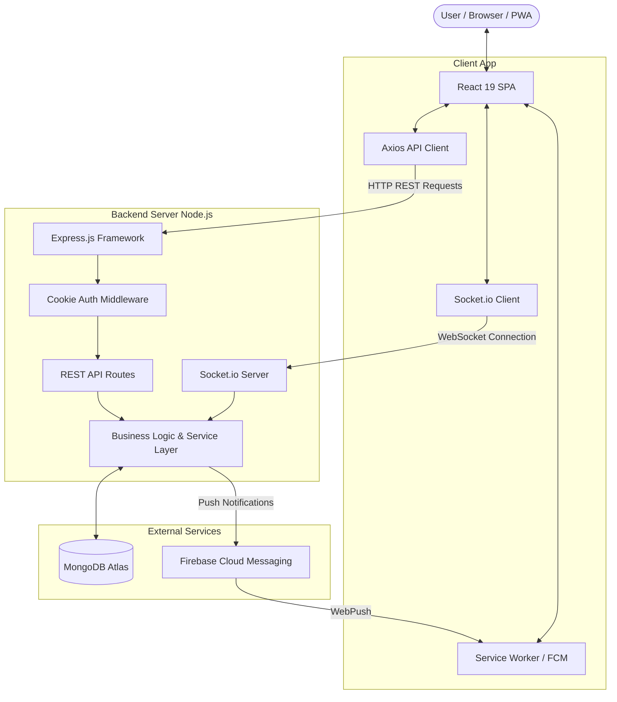
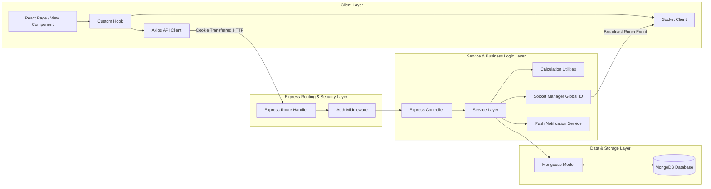
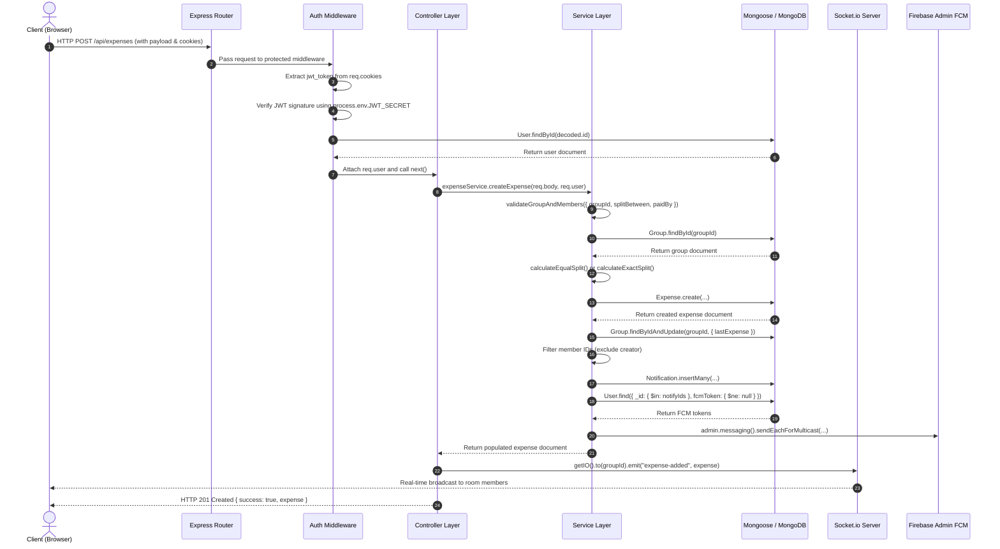
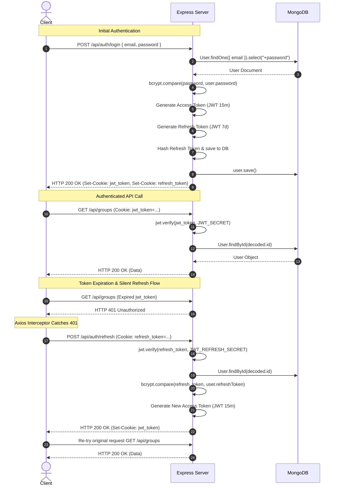
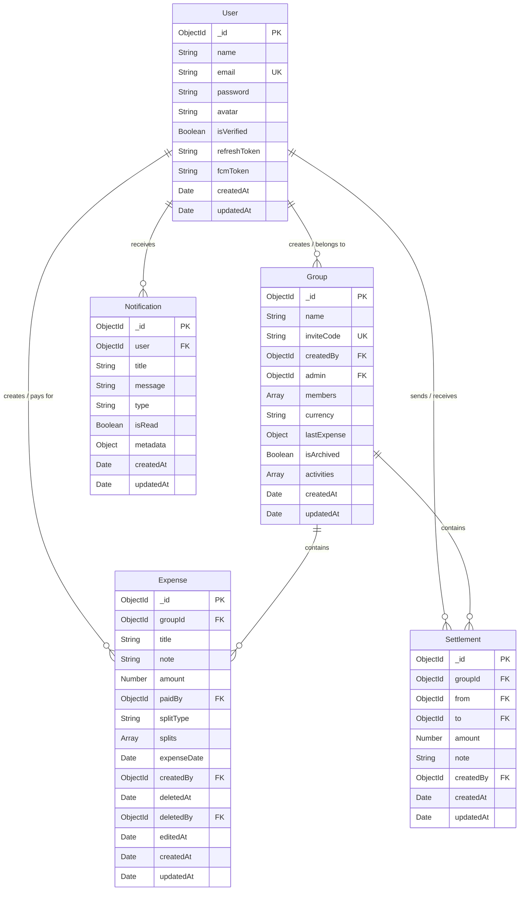
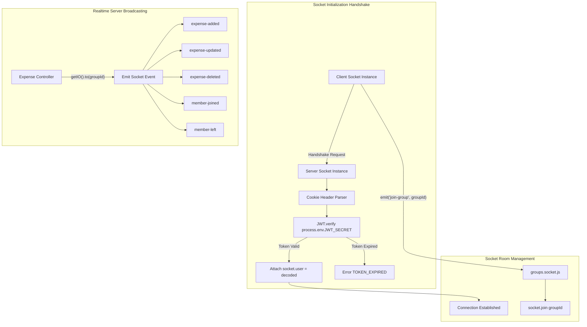
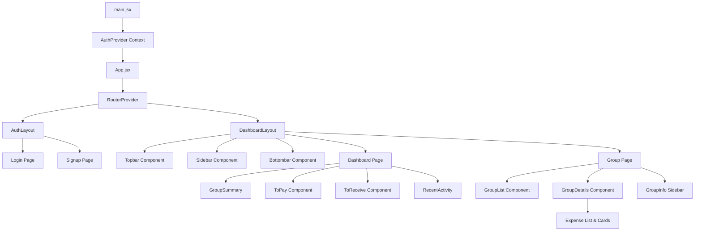
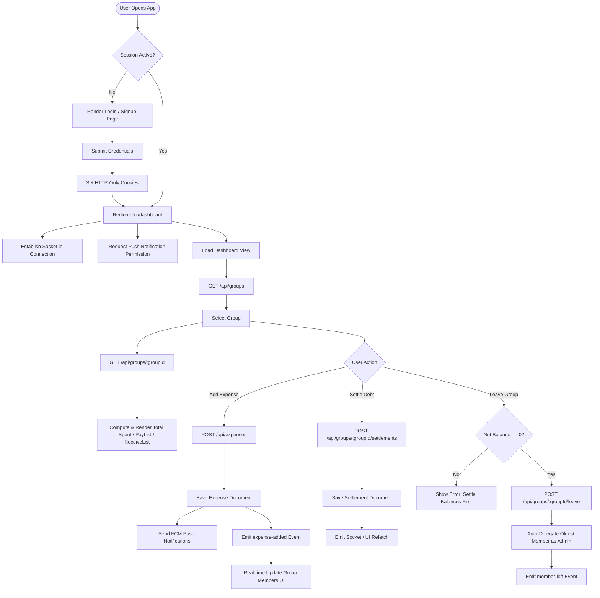

# SplitX — System Engineering & Architectural Documentation

> **Status:** Production System Reverse-Engineered  
> **Target Audience:** Engineering Staff, Technical Leads, and Onboarding Developers  
> **Document Purpose:** Complete structural, operational, and behavioral specification of the existing SplitX application codebase.

---

## 1. Executive Summary

### 1.1 What is this project?
**SplitX** is a full-stack, web-based collaborative expense sharing and debt settlement platform built using Node.js, Express, MongoDB, React, Socket.io, and Firebase Cloud Messaging (FCM). It functions as a progressive web application (PWA).

### 1.2 What problem does it solve?
SplitX automates group expense tracking, balance calculations (who owes whom and how much), settlement recordings, real-time group updates, and push notifications among members in a shared group context (e.g., roommates, trips, events).

### 1.3 Main Features
* **User Authentication & Session Management:** JWT-based access and refresh token lifecycle stored in HTTP-only cookies (`jwt_token` and `refresh_token`), user registration, login, logout, and session restoration (`/api/auth/me`).
* **Group Management:** Group creation, unique 8-character hex invite code generation, invite code verification, join group flow, and leave group flow with admin delegation and balance zeroing enforcement.
* **Expense Lifecycle:** Adding expenses with equal (`EQUAL`) or exact (`EXACT`) split allocations, soft-deleting expenses (`deletedAt`), editing expenses (`editedAt`), and automated penny-rounding reconciliation for equal splits.
* **Net Balance & Settlement Calculations:** Dynamic calculations of group net balances (`payList` and `receiveList`) based on non-deleted expenses and settlements; recording settlements between members.
* **Real-time WebSockets:** Room-based real-time synchronization (`join-group`, `leave-group`) emitting live socket events for expense creation, updates, deletions, and member joins/leaves.
* **Push Notifications:** Web push and mobile notifications powered by Firebase Cloud Messaging (FCM) and Service Workers, persisting notification documents in MongoDB.
* **Progressive Web App (PWA):** Service worker integration (`vite-plugin-pwa`) with offline shell fallback and web push capability.

### 1.4 Current Architecture Overview
The system follows a traditional multi-tier Client-Server architecture:
* **Client Tier:** Single Page Application (SPA) built with React 19, Vite, React Router v7, Framer Motion, and Axios. Uses browser HTTP-only cookies for session transport and Socket.io-client for real-time WebSocket communication.
* **Server Tier:** Monolithic Node.js/Express.js application exposed via HTTP and WebSockets (`http.createServer(app)` + `socket.io`). Uses a layered architecture (Routes $\rightarrow$ Middleware $\rightarrow$ Controllers $\rightarrow$ Services $\rightarrow$ Mongoose Models).
* **Database Tier:** MongoDB (hosted on MongoDB Atlas) managed via Mongoose ODM for document persistence.
* **Push Services:** Firebase Admin SDK emitting WebPush/Android multicast FCM notifications.



---

## 2. Technology Stack

| Layer | Technology | Version | Purpose |
| :--- | :--- | :--- | :--- |
| **Frontend Framework** | React | `^19.2.0` | User Interface rendering and component management |
| **Frontend Build Tool** | Vite | `^7.2.4` | Development server, HMR, and assets bundling |
| **Routing** | React Router DOM | `^7.12.0` | Client-side routing (`createBrowserRouter`) |
| **PWA Engine** | `vite-plugin-pwa` | `^1.2.0` | Service worker generation and manifest management |
| **HTTP Client** | Axios | `^1.13.4` | REST API communication with interceptors |
| **UI Components & Icons**| Lucide React & RemixIcon | `^0.577.0`, `^4.8.0` | Graphic icons and visual elements |
| **Animations** | Framer Motion | `^12.35.2` | Page transitions and UI layout animations |
| **Toast Notifications**| React Hot Toast & React Toastify | `^2.6.0`, `^11.0.5` | In-app feedback popups |
| **Charts** | Recharts | `^3.7.0` | Dashboard financial analytics visualization |
| **Backend Runtime** | Node.js (CommonJS) | Runtime | Event-driven backend execution environment |
| **Backend Framework** | Express.js | `^5.2.1` | REST API HTTP server and routing |
| **Database ODM** | Mongoose | `^9.1.5` | Schema validation and MongoDB object mapping |
| **Real-time Server** | Socket.io | `^4.8.3` | Bi-directional WebSocket communication |
| **Authentication** | `jsonwebtoken` & `bcrypt` | `^9.0.3`, `^6.0.0` | JWT sign/verify and password hashing (10 rounds) |
| **Cookie Parser** | `cookie-parser` & `cookie` | `^1.4.7`, `^1.1.1` | Express & Socket handshake HTTP cookie extraction |
| **Push Notifications**| `firebase-admin` (Backend) | `^13.7.0` | Sending multicast push notifications |
| **Client Firebase** | `firebase` (Frontend) | `^12.10.0` | Registering VAPID keys and receiving messaging tokens |
| **Email Service** | Resend SDK | `^6.9.2` | Operational email infrastructure integration |

---

## 3. Folder Structure

```
SplitX/
├── Backend/
│   ├── firebase/
│   │   ├── firebaseAdmin.js          # Firebase Admin SDK initialization using serviceAccountKey.json
│   │   └── serviceAccountKey.json    # Firebase GCP service account credentials
│   ├── middleware/
│   │   └── auth.middleware.js        # HTTP request JWT validation middleware
│   ├── src/
│   │   ├── app.js                    # Express app configuration, CORS, cookies, routes, global error handler
│   │   ├── config/
│   │   │   └── database.js           # Mongoose MongoDB database connection function
│   │   ├── controller/
│   │   │   ├── auth.controller.js    # Register, login, logout, refresh token, session restoration, FCM token updates
│   │   │   ├── expense.controller.js # Expense CRUD HTTP controllers & realtime socket triggers
│   │   │   ├── group.controller.js   # Group creation, retrieval, invite code checks, joining, leaving
│   │   │   ├── profile.controller.js # User profile statistics calculation & profile updates
│   │   │   └── settlement.controller.js # Settlement creation & retrieval controllers
│   │   ├── models/
│   │   │   ├── expense.model.js      # Expense Mongoose Schema with splits array and soft delete fields
│   │   │   ├── group.model.js        # Group Mongoose Schema with member array, admin, inviteCode, and activity logs
│   │   │   ├── notification.model.js # Notification Mongoose Schema with metadata
│   │   │   ├── settlement.model.js   # Settlement Mongoose Schema tracking payer and payee
│   │   │   └── users.model.js        # User Mongoose Schema with email uniqueness and hashed password
│   │   ├── routes/
│   │   │   ├── auth.routes.js        # Router endpoints for /api/auth
│   │   │   ├── expense.route.js      # Router endpoints for /api/expenses
│   │   │   ├── group.routes.js       # Router endpoints for /api/groups
│   │   │   ├── profile.routes.js     # Router endpoints for /api/profile
│   │   │   └── settlement.routes.js  # Router endpoints for /api/groups/:groupId/settlements
│   │   ├── services/
│   │   │   ├── Expenses/
│   │   │   │   ├── createExpense.service.js # Business logic for equal/exact expense creation & rounding
│   │   │   │   ├── deleteExpense.js         # Soft-delete expense logic
│   │   │   │   ├── duplicateCheck.js        # 10-second duplicate expense window validation
│   │   │   │   ├── editExpense.js           # Expense modification logic
│   │   │   │   ├── getExpenses.service.js   # Group expense list query service
│   │   │   │   ├── index.js                 # Service barrel export
│   │   │   │   └── validators.js            # Group membership validation before expense operations
│   │   │   ├── calculation/
│   │   │   │   ├── buildPayList.js         # Greedy debt algorithm computing who current user owes
│   │   │   │   ├── buildReceiveList.js     # Greedy debt algorithm computing who owes current user
│   │   │   │   ├── calculateNetBalance.js  # Net balance subtraction (paid - share)
│   │   │   │   ├── calculateTotalSpent.js  # Total sum of non-deleted expense amounts
│   │   │   │   ├── calculateUserPaid.js    # Total amount paid by a user
│   │   │   │   └── calculateUserShare.js   # Total expense share obligation of a user
│   │   │   ├── groups.service.js            # Aggregated group financial metrics computation service
│   │   │   └── notification/
│   │   │       ├── createNotification.js   # Persists notifications and dispatches FCM messages
│   │   │       └── sendPushNotification.js # Multicast Firebase Cloud Messaging delivery logic
│   │   ├── sockets/
│   │   │   ├── handlers/
│   │   │   │   └── groups.socket.js        # Socket room join/leave listeners (`join-group`, `leave-group`)
│   │   │   ├── middleware/
│   │   │   │   └── socketAuth.js           # Handshake cookie parser & JWT verifier middleware
│   │   │   ├── index.js                    # Socket.io server instantiation
│   │   │   └── socketManager.js            # Global Singleton getter/setter for `io` server instance
│   │   └── templets/                       # Email / HTML templates container
│   ├── utils/
│   │   └── splitCalculator.js              # Equal & exact split calculation and penny-rounding adjustments
│   ├── .env                                # Server environment variables
│   ├── load-test.js                        # k6 load testing script for group endpoints
│   ├── package.json                        # Backend dependencies & scripts
│   └── server.js                           # Entry point: starts HTTP server & Socket.io listener
└── client/
    ├── api/
    │   ├── apiClient.js                    # Axios instance with request/response interceptors & token refresh queue
    │   ├── auth.api.js                     # Auth REST endpoint calls
    │   ├── expense.api.js                  # Expense REST endpoint calls
    │   ├── group.api.js                    # Group REST endpoint calls
    │   ├── notification.api.js             # FCM Token REST endpoint calls
    │   ├── profile.api.js                  # Profile REST endpoint calls
    │   └── settlement.api.js               # Settlement REST endpoint calls
    ├── public/
    │   ├── firebase-messaging-sw.js        # Background FCM WebPush service worker
    │   └── icons/                          # PWA web icons
    ├── src/
    │   ├── assets/                         # Static image assets
    │   ├── auth/                           # Login, Signup, AuthLayout components
    │   ├── components/                     # Reusable components (ProtectedRoute, Loaders, Bottombar, Topbar)
    │   ├── context/
    │   │   └── AuthContext.jsx             # Authentication context provider managing user state and socket connections
    │   ├── hooks/
    │   │   ├── useCreateGroup.jsx          # Hook for handling group creation modal state
    │   │   ├── useDashboard.jsx            # Hook fetching user groups and selected group financial details
    │   │   ├── useGroupDetail.jsx          # Hook fetching a single group's metrics
    │   │   ├── useGroupExpenses.js         # State & socket synchronizer hook for expenses
    │   │   ├── useGroupManager.jsx         # Hook managing group list state and active selection
    │   │   ├── useGroupSettlement.jsx      # Hook fetching settlement history and creating settlements
    │   │   └── useGroupSocket.js           # Socket event listener hook (`expense-added`, `member-joined`, etc.)
    │   ├── layouts/
    │   │   └── DashboardLayout.jsx         # Main layout wrapper with sidebar, topbar, and outlet
    │   ├── pages/
    │   │   ├── Dashboard_Page/             # Dashboard page, summary cards, to-pay/receive components
    │   │   ├── Group_Page/                 # Group list, group details chat view, group info panel
    │   │   └── Profile_Page/               # User profile edit and statistics view
    │   ├── routes/
    │   │   └── index.jsx                   # React Router DOM configuration (`createBrowserRouter`)
    │   ├── sockets/
    │   │   └── socket.js                   # Socket.io client singleton configuration
    │   ├── styles/                         # CSS stylesheets (`global.css`, `variavles.css`)
    │   ├── utils/
    │   │   ├── getFcmToken.js              # Service Worker registration & FCM token retriever
    │   │   ├── getRecentActivities.js      # Activity formatter utility
    │   │   └── toastHandler.js             # Toast notification helper
    │   ├── App.jsx                         # Main App component attaching RouterProvider & Toaster
    │   └── main.jsx                        # Entry point: renders React DOM with StrictMode & AuthProvider
    ├── index.html                          # HTML template
    ├── package.json                        # Frontend dependencies & scripts
    └── vite.config.js                      # Vite & VitePWA configuration
```

---

## 4. High-Level Architecture

### Layer Responsibilities



1. **Client Layer (React Component & Hooks):** Manages local state, handles user interactions, renders dynamic layouts, and delegates network requests to custom hooks (`useGroupExpenses`, `useDashboard`) and Axios endpoints.
2. **Transport & Cookie Security Middleware:** Parses incoming HTTP requests, extracts signed HTTP-only cookies (`jwt_token`, `refresh_token`), verifies JWT validity using secret keys, and injects the authenticated `req.user` payload into the request context.
3. **Controller Layer:** Validates HTTP request params/body presence, handles request/response lifecycle, and invokes underlying domain services. Returns JSON responses with status codes (`200`, `201`, `400`, `401`, `403`, `404`, `500`).
4. **Service Layer:** Houses business domain logic: validating group membership (`validateGroupAndMembers`), equal/exact expense division (`splitCalculator`), penny-rounding distribution, soft-deletes, activity log pushes, and FCM push notifications.
5. **Calculation Engine Utilities:** Performs array aggregations on non-deleted expenses and settlements to build net balance maps and generate `payList` (debtors) and `receiveList` (creditors) dynamically.
6. **Data Storage Layer:** Executes Mongoose queries (`find`, `findByIdAndUpdate`, `insertMany`, `create`) against MongoDB Atlas collections.
7. **Real-time Event Server Layer:** Holds active WebSocket connections. When controllers execute write operations, they fetch the `io` instance via `getIO()` and broadcast events to the corresponding `groupId` room.

---

## 5. Request Lifecycle

### Detailed Request Flow Matrix



#### Specific Flow Details:

1. **User Registration (`POST /api/auth/register`):**
   - **Client:** Sends `{ name, email, password }`.
   - **Controller:** Checks required fields; queries `User.findOne({ email })` for duplicates. Hashes password using `bcrypt.hash(password, 10)`. Creates user document with `isVerified: true`.
   - **Response:** `201 Created` with basic user metadata (`id`, `name`, `email`).

2. **User Login (`POST /api/auth/login`):**
   - **Client:** Sends `{ email, password }`.
   - **Controller:** Fetches user including password select (`.select("+password")`). Compares hash using `bcrypt.compare`. Signs 15-minute `accessToken` and 7-day `refreshToken`. Hashes `refreshToken` with `bcrypt` and saves to user document (`user.refreshToken = refreshHash`). Sets two HTTP-only cookies (`jwt_token` and `refresh_token`).
   - **Response:** `200 OK` returning `{ success: true, message, user }`.

3. **Session Restoration (`GET /api/auth/me`):**
   - **Client:** Invoked inside `AuthContext.jsx` `loadMe()` on page load.
   - **Middleware:** Validates `jwt_token` cookie; attaches user object to `req.user`.
   - **Interceptor Retry:** If `jwt_token` is expired (`401`), `apiClient` interceptor automatically posts to `/api/auth/refresh`, receives new cookie, and retries `GET /api/auth/me`.

4. **Group Creation (`POST /api/groups`):**
   - **Client:** Sends `{ name }`.
   - **Controller:** Generates unique 8-character hex string `inviteCode` using `crypto.randomBytes(4).toString("hex")` with up to 5 collision retries. Creates group with creator added as first member and designated `admin`.
   - **Response:** `201 Created` returning `{ _id, name, inviteCode, admin }`.

5. **Joining Group (`POST /api/groups/join/:inviteCode`):**
   - **Client:** Sends request parameter `inviteCode`.
   - **Controller:** Finds group by `inviteCode`. Checks if `req.user.id` is already in `group.members`. If not, pushes `{ userId }` to `group.members`. Saves document. Emits `member-joined` event to socket room. Dispatches push notification to existing members.
   - **Response:** `200 OK` with populated member documents.

6. **Leaving Group (`POST /api/groups/:groupId/leave`):**
   - **Controller:** Verifies group membership. Computes `getUserNetBalance(groupId, userId)`. If balance $\neq 0$, rejects with `400 Bad Request` ("Please settle all balances before leaving"). If admin is leaving, sorts remaining members by `joinedAt` ascending and auto-assigns admin privileges to the oldest member. Removes user from `group.members`, appends `GROUP_LEAVE` activity to `group.activities`, saves group, and emits `member-left` to socket room.

7. **Create Settlement (`POST /api/groups/:groupId/settlements`):**
   - **Controller:** Reads `{ to, amount, note }`. Validates whether `req.user._id` owes `to` via `getPayList()`. Creates `Settlement` document. Dispatches push notification to recipient user. Returns `201 Created`.

---

## 6. Authentication Flow

### Authentication Architecture Diagram



### Token Configuration Details
* **Access Token (`jwt_token`):**
  * Secret Key: `process.env.JWT_SECRET`
  * Expiry: `15 minutes`
  * Transport: Cookie options `{ httpOnly: true, secure: true, sameSite: "none", maxAge: 15 * 60 * 1000 }`
* **Refresh Token (`refresh_token`):**
  * Secret Key: `process.env.JWT_REFRESH_SECRET`
  * Expiry: `7 days`
  * Storage: Hashed in database (`bcrypt.hash(refreshToken, 10)`) under `User.refreshToken`.
  * Transport: Cookie options `{ httpOnly: true, secure: true, sameSite: "none", maxAge: 7 * 24 * 60 * 60 * 1000 }`

---

## 7. Database Documentation

### Entity-Relationship Diagram



### Collection Schema Specifications

#### 1. `User` Collection (`users.model.js`)
* **Purpose:** Stores user authentication credentials, session refresh hashes, and push notification tokens.
* **Fields:**
  * `name`: `{ type: String, required: true, trim: true }`
  * `email`: `{ type: String, lowercase: true, trim: true, unique: true, required: true }`
  * `password`: `{ type: String, required: true, minlength: 6, select: false }`
  * `avatar`: `{ type: String, default: null }`
  * `isVerified`: `{ type: Boolean, default: true }`
  * `refreshToken`: `{ type: String }`
  * `fcmToken`: `{ type: String, default: null }`
* **Indexes:** `email` (Unique index).

#### 2. `Group` Collection (`group.model.js`)
* **Purpose:** Defines shared groups, membership, admin assignments, denormalized last expense, and activity logs.
* **Fields:**
  * `name`: `{ type: String, required: true, trim: true }`
  * `inviteCode`: `{ type: String, unique: true, required: true }`
  * `createdBy`: `{ type: ObjectId, ref: "User", required: true }`
  * `admin`: `{ type: ObjectId, ref: "User", required: true }`
  * `members`: `[{ userId: { type: ObjectId, ref: "User", required: true }, joinedAt: { type: Date, default: Date.now } }]`
  * `currency`: `{ type: String, default: "INR" }`
  * `lastExpense`: `{ expenseId, title, amount, paidBy: { _id, name }, createdBy: { _id, name }, createdAt }`
  * `isArchived`: `{ type: Boolean, default: false }`
  * `activities`: `[{ type: { type: String, enum: ["GROUP_LEAVE"] }, userId, userName, createdAt }]`
* **Indexes:** `groupSchema.index({ "members.userId": 1, isArchived: 1 })`.

#### 3. `Expense` Collection (`expense.model.js`)
* **Purpose:** Records expenses incurred in a group, split breakdown, and soft deletion state.
* **Fields:**
  * `groupId`: `{ type: ObjectId, ref: "Group", required: true, index: true }`
  * `title`: `{ type: String, required: true, trim: true }`
  * `note`: `{ type: String, trim: true }`
  * `amount`: `{ type: Number, required: true, min: 1 }`
  * `paidBy`: `{ type: ObjectId, ref: "User", required: true }`
  * `splitType`: `{ type: String, enum: ["EQUAL", "EXACT"], required: true }`
  * `splits`: `[{ userId: { type: ObjectId, ref: "User" }, amount: Number }]`
  * `expenseDate`: `{ type: Date, required: true }`
  * `createdBy`: `{ type: ObjectId, ref: "User", required: true }`
  * `deletedAt`: `{ type: Date, default: null }`
  * `deletedBy`: `{ type: ObjectId, ref: "User", default: null }`
  * `editedAt`: `{ type: Date, default: null }`
* **Indexes:** `expenseSchema.index({ groupId: 1, deletedAt: 1 })`.

#### 4. `Settlement` Collection (`settlement.model.js`)
* **Purpose:** Tracks debt settlement payments between two group members.
* **Fields:**
  * `groupId`: `{ type: ObjectId, ref: "Group", required: true, index: true }`
  * `from`: `{ type: ObjectId, ref: "User", required: true }`
  * `to`: `{ type: ObjectId, ref: "User", required: true }`
  * `amount`: `{ type: Number, required: true, min: 1 }`
  * `note`: `{ type: String, trim: true }`
  * `createdBy`: `{ type: ObjectId, ref: "User", required: true }`
* **Indexes:** `settlementSchema.index({ groupId: 1, from: 1, to: 1 })`.

#### 5. `Notification` Collection (`notification.model.js`)
* **Purpose:** Persists in-app user notifications.
* **Fields:**
  * `user`: `{ type: ObjectId, ref: "User", required: true }`
  * `title`: `{ type: String, required: true }`
  * `message`: `{ type: String, required: true }`
  * `type`: `{ type: String, enum: ["expense", "settlement", "reminder", "group"], required: true }`
  * `isRead`: `{ type: Boolean, default: false }`
  * `metadata`: `{ expenseId: ObjectId, groupId: ObjectId }`
* **Indexes:** `notificationSchema.index({ user: 1, createdAt: -1 })`.

---

## 8. API Documentation

### 8.1 Authentication Endpoints (`/api/auth`)

| Method | Endpoint | Auth | Body Payload | Description |
| :--- | :--- | :--- | :--- | :--- |
| `POST` | `/register` | No | `{ name, email, password }` | Registers a new user account |
| `POST` | `/login` | No | `{ email, password }` | Authenticates user and sets HTTP-only cookies |
| `POST` | `/logout` | No | None | Clears auth cookies and nullifies DB refresh token |
| `POST` | `/refresh` | No | Cookie (`refresh_token`) | Validates refresh token and issues new access cookie |
| `GET` | `/me` | Yes | None | Returns current user session object |
| `PATCH` | `/fcm-token` | Yes | `{ token }` | Saves FCM push notification token to user record |

### 8.2 Group Endpoints (`/api/groups`)

| Method | Endpoint | Auth | Body / Params Payload | Description |
| :--- | :--- | :--- | :--- | :--- |
| `POST` | `/` | Yes | `{ name }` | Creates a new group |
| `GET` | `/` | Yes | None | Fetches all active groups for authenticated user |
| `GET` | `/:groupId` | Yes | `groupId` (param) | Fetches group metadata, net balances, pay/receive lists |
| `GET` | `/invite/:inviteCode`| No | `inviteCode` (param) | Checks validity of an invite link |
| `POST` | `/join/:inviteCode`  | Yes | `inviteCode` (param) | Joins user to group via invite code |
| `POST` | `/:groupId/leave`   | Yes | `groupId` (param) | Leaves group if net balance is zero |

### 8.3 Expense Endpoints (`/api/expenses`)

| Method | Endpoint | Auth | Body / Query Payload | Description |
| :--- | :--- | :--- | :--- | :--- |
| `POST` | `/` | Yes | `{ groupId, title, amount, paidBy, splitType, splitBetween/splits, expenseDate }` | Creates an expense and triggers notifications |
| `GET` | `/` | Yes | `?groupId=...` (query) | Fetches expenses for a specific group |
| `PATCH` | `/:expenseId` | Yes | `{ title, amount, note, paidBy, splitType, splits, expenseDate }` | Edits expense details |
| `DELETE`| `/:expenseId` | Yes | `expenseId` (param) | Soft-deletes an expense (`deletedAt`) |

### 8.4 Settlement Endpoints (`/api/groups`)

| Method | Endpoint | Auth | Body / Params Payload | Description |
| :--- | :--- | :--- | :--- | :--- |
| `POST` | `/:groupId/settlements` | Yes | `{ to, amount, note }` | Creates a debt settlement between members |
| `GET` | `/:groupId/settlements` | Yes | `groupId` (param) | Fetches settlement history for a group |

### 8.5 Profile Endpoints (`/api/profile`)

| Method | Endpoint | Auth | Body Payload | Description |
| :--- | :--- | :--- | :--- | :--- |
| `GET` | `/stats` | Yes | None | Computes total group, expense, and settlement counts |
| `PATCH` | `/` | Yes | `{ name }` | Updates user's display name |

---

## 9. Socket Architecture

### Real-Time Socket Architecture Diagram



### Event Specifications
* **Authentication Middleware (`socketAuth.js`):** Extracts `jwt_token` from handshake headers `cookie` field. Verifies JWT. If token is expired, returns `TOKEN_EXPIRED` error object to trigger client-side re-authentication.
* **Server Listeners (`groups.socket.js`):**
  * `join-group` (`groupId`): Adds socket instance to Socket.io room identified by `groupId`.
  * `leave-group` (`groupId`): Removes socket instance from `groupId` room.
* **Server Emitters (Dispatched from REST Controllers):**
  * `expense-added`: Emitted when an expense is successfully created.
  * `expense-updated`: Emitted when an expense is modified.
  * `expense-deleted`: Emitted on soft-deletion.
  * `member-joined`: Emitted when a user joins via invite link.
  * `member-left`: Emitted when a user leaves the group.

---

## 10. Frontend Architecture

### Component & State Tree



### Key Frontend Hooks & Functionality
* **`AuthContext.jsx`:** Manages global `user` state and `loading` status. Automatically executes `loadMe()` on initial app mount. Connects WebSockets (`connectSocket()`) and requests FCM permission (`generateFcmToken()`) whenever `user` state becomes non-null.
* **`useGroupExpenses.js`:** Encapsulates REST API expense mutations and socket event synchronization (`addExpenseLocal`, `updateExpenseLocal`, `deleteExpenseLocal`).
* **`useGroupSocket.js`:** Listens to incoming Socket.io events (`expense-added`, `member-joined`, etc.) for the active `groupId` room and invokes UI updates.
* **`apiClient.js` Interceptor:** Axios instance managing HTTP status codes. On encountering a `401 Unauthorized` response, queues pending requests, posts to `/api/auth/refresh`, and retries failed requests seamlessly.

---

## 11. Backend Architecture

### Architecture Layers & Responsibility Matrix

```
[ HTTP Requests / WebSockets ]
             │
             ▼
[ Middleware Layer ] ──> auth.middleware.js / socketAuth.js
             │
             ▼
[ Controller Layer ] ──> group.controller.js / expense.controller.js
             │
             ▼
[ Service Layer ]    ──> createExpense.service.js / groups.service.js
             │
             ├──> [ Calculation Engine ] ──> buildPayList.js / splitCalculator.js
             └──> [ Notification Engine ] ──> sendPushNotification.js
             │
             ▼
[ Mongoose Models ]  ──> users.model.js / group.model.js / expense.model.js
             │
             ▼
[ MongoDB Database ]
```

### Business Logic Highlights
* **Penny Rounding Algorithm (`splitCalculator.js`):** When dividing an amount equally (e.g. ₹100 split among 3 members = 33.33 each, total 99.99), the residual penny difference (`diff = 0.01`) is dynamically calculated and added to the payer's share (`payerSplit.amount += diff`) to preserve monetary precision.
* **Greedy Balance Calculation (`buildPayList.js` & `buildReceiveList.js`):**
  1. Iterates over all non-deleted expenses to accumulate total `paid` and `share` per member.
  2. Computes initial net balance per user: $\text{Net} = \text{Paid} - \text{Share}$.
  3. Adjusts net balances using settlement transactions.
  4. Identifies creditors ($\text{Net} > 0$) and debtors ($\text{Net} < 0$).
  5. Executes greedy distribution to allocate exact amounts owed by the current user to creditors.

---

## 12. Environment Variables

### Backend Environment Variables (`Backend/.env`)

| Variable Name | Purpose / Function | Confidentiality Level |
| :--- | :--- | :--- |
| `MONGO_URL` | MongoDB connection URI string pointing to database instance | **High Security** |
| `JWT_SECRET` | Secret key used to sign and verify short-lived access JWT tokens | **High Security** |
| `JWT_REFRESH_SECRET` | Secret key used to sign and verify long-lived refresh JWT tokens | **High Security** |
| `RESEND_API` | API key for Resend email distribution platform | **High Security** |
| `EMAIL_FROM` | Verified sender email address for outgoing emails | **Standard** |
| `CLIENT_ORIGIN` | Comma-separated list of allowed CORS HTTP origins | **Standard** |
| `PORT` | Local network HTTP server listening port (Default: 3000) | **Standard** |

### Frontend Environment Variables (`client/.env`)

| Variable Name | Purpose / Function | Confidentiality Level |
| :--- | :--- | :--- |
| `VITE_FIREBASE_VAPID_KEY` | Public VAPID key used for WebPush browser notification subscription | **Public Key** |
| `VITE_API_URL` | Base HTTP endpoint URL for API requests (`https://.../api`) | **Public URL** |

---

## 13. Dependency Analysis

### Backend Dependencies (`Backend/package.json`)

* **`express` (`^5.2.1`):** Web application framework handling routing and middleware execution.
* **`mongoose` (`^9.1.5`):** Object Data Modeling (ODM) library for MongoDB validation and querying.
* **`jsonwebtoken` (`^9.0.3`):** JSON Web Token implementation for stateless auth tokens.
* **`bcrypt` (`^6.0.0`):** Password hashing library using key expansion algorithms.
* **`socket.io` (`^4.8.3`):** Event-based real-time communication engine.
* **`firebase-admin` (`^13.7.0`):** Server SDK for dispatching FCM mobile and web push notifications.
* **`cookie-parser` (`^1.4.7`):** Formats HTTP `Cookie` headers into `req.cookies` JS objects.
* **`cors` (`^2.8.6`):** Configures Cross-Origin Resource Sharing HTTP headers.
* **`dotenv` (`^17.2.4`):** Loads environment variables from `.env` file into `process.env`.
* **`resend` (`^6.9.2`):** Email messaging API client SDK.

### Frontend Dependencies (`client/package.json`)

* **`react` & `react-dom` (`^19.2.0`):** React 19 core UI rendering framework.
* **`react-router-dom` (`^7.12.0`):** Browser side routing library.
* **`axios` (`^1.13.4`):** Promise-based HTTP client for API interactions.
* **`socket.io-client` (`^4.8.3`):** Client-side Socket.io WebSocket connection client.
* **`framer-motion` (`^12.35.2`):** Animation engine for fluid UI motion.
* **`vite-plugin-pwa` (`^1.2.0`):** Plugin generating web app manifests and service workers.
* **`firebase` (`^12.10.0`):** Client SDK for WebPush FCM token retrieval.
* **`recharts` (`^3.7.0`):** SVG charting library for rendering financial metrics.
* **`react-hot-toast` & `react-toastify`:** In-app popups and status messages.

---

## 14. Current System Flow

### Complete System Operational Flowchart



---

## 15. Code Organization

### Architectural Patterns & Code Conventions

1. **CommonJS Module Standard (Backend):** Uses standard CommonJS `require()` and `module.exports` syntax throughout the server code.
2. **ESM Module Standard (Frontend):** Uses standard ES Modules (`import` / `export default`) throughout Vite and React components.
3. **Controller-Service Separation:** Controllers handle HTTP transport parameters, response codes, and socket event triggers. Business logic and Mongoose database queries reside within the `services/` directory.
4. **Data Normalization Strategy:** Calculations read ObjectIds via normalized string comparisons (`id.toString()`) to maintain uniformity across Mongoose BSON identifiers.
5. **Soft Deletion Pattern:** Expense deletion updates the `deletedAt` and `deletedBy` fields rather than removing documents permanently from MongoDB.

---

## 16. Current System Limitations

1. **In-Memory Dynamic Balance Computation:** Group balances, pay lists, and receive lists are dynamically computed in memory during `GET /api/groups/:groupId` requests by querying all group expenses and settlements.
2. **Single Instance In-Memory Socket Manager:** WebSockets are managed in-memory on a single Node server instance via `socketManager.js`.
3. **Soft-Deleted Expense Ledger Adjustments:** Soft-deleting an expense updates the `deletedAt` field; financial ledger reversal relies on filtering out `deletedAt: null` documents during balance aggregation.
4. **Un-bound Socket Room Joins:** Sockets join rooms using client-emitted `groupId` parameters without verifying membership against the database during the `join-group` socket event.
5. **No Database Transaction Wrappers:** Multi-document write operations run as individual async database queries rather than wrapped MongoDB session transactions.

---

## 17. README Draft

Below is the complete text draft for `README.md`:

```markdown
# SplitX — Smart Group Expense & Settlement Platform

SplitX is a progressive web application (PWA) designed to simplify collaborative expense splitting, group debt tracking, and settlements in real time.

## 🚀 Features

- **Authentication & Security:** JWT Access & Refresh token rotation stored in HTTP-Only cookies.
- **Group Expense Splitting:** Supports equal (`EQUAL`) and exact (`EXACT`) split allocations with automatic penny-rounding handling.
- **Dynamic Debt Calculation:** Calculates net balances, pay lists, and receive lists dynamically.
- **Real-Time Synchronisation:** Instant socket updates for group activities and expense changes via Socket.io.
- **Push Notifications:** Firebase Cloud Messaging (FCM) integration for mobile and desktop web push alerts.
- **PWA Ready:** Installable application shell with offline asset caching.

## 🛠️ Tech Stack

- **Frontend:** React 19, Vite, React Router v7, Framer Motion, Recharts, Axios
- **Backend:** Node.js, Express.js, Socket.io, Firebase Admin SDK
- **Database:** MongoDB Atlas via Mongoose ODM
- **Authentication:** JSON Web Tokens (JWT) & HTTP-Only Cookies

## 📦 Project Structure

```
SplitX/
├── Backend/          # Node.js / Express REST API & Socket.io server
└── client/           # React 19 Single Page Application & PWA
```

## 🔧 Environment Variables

### Backend (`Backend/.env`)
```env
PORT=3000
MONGO_URL=your_mongodb_connection_string
JWT_SECRET=your_jwt_access_secret
JWT_REFRESH_SECRET=your_jwt_refresh_secret
RESEND_API=your_resend_api_key
CLIENT_ORIGIN=http://localhost:5173
```

### Frontend (`client/.env`)
```env
VITE_API_URL=http://localhost:3000/api
VITE_FIREBASE_VAPID_KEY=your_firebase_vapid_key
```

## 💻 Running Locally

### 1. Start the Backend Server
```bash
cd Backend
npm install
npm run dev
```

### 2. Start the Frontend Client
```bash
cd client
npm install
npm run dev
```

Open [http://localhost:5173](http://localhost:5173) in your browser.
```

---

## 18. Documentation Index

Suggested file structure for dedicated system documentation under a `docs/` folder:

```
docs/
├── 01_Architecture_Overview.md      # High-level architecture & system design
├── 02_Backend_Services.md           # Backend services, controllers & calculation engine
├── 03_Frontend_Architecture.md      # React components, hooks, contexts & routing
├── 04_Database_Schema.md            # MongoDB collection schemas & ER diagrams
├── 05_API_Reference.md              # REST API endpoint specifications
├── 06_Socket_Events.md              # Socket.io connection lifecycle & room events
├── 07_Authentication_Flow.md        # JWT cookie rotation & session management
├── 08_Push_Notifications.md         # Service Worker & FCM integration guide
└── 09_Environment_Variables.md     # Configuration management guide
```
